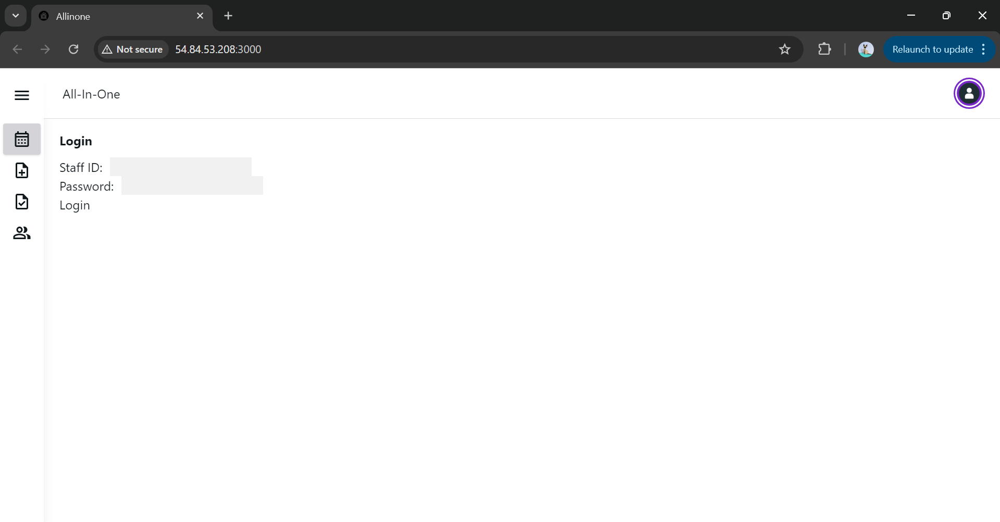
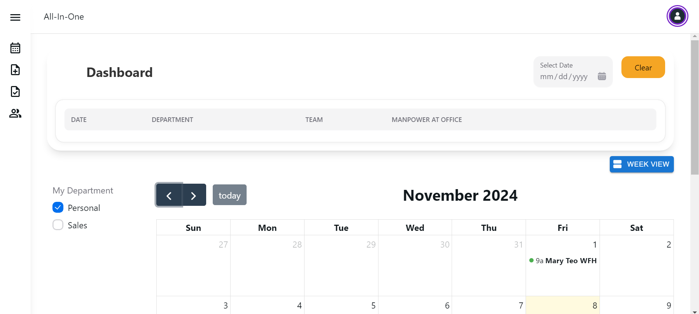
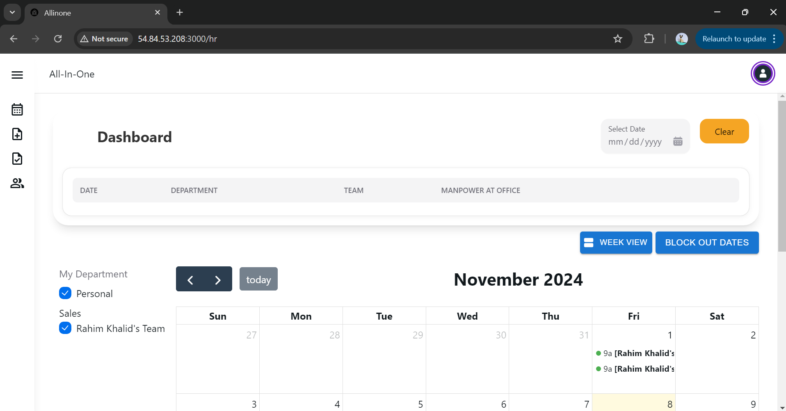
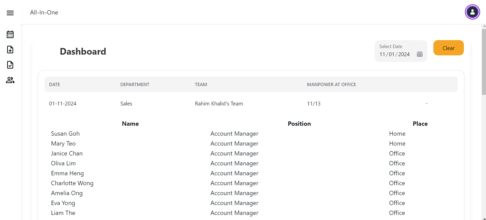
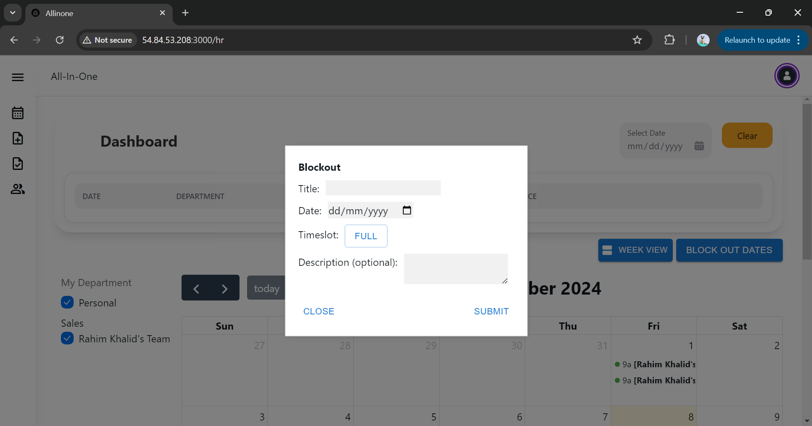
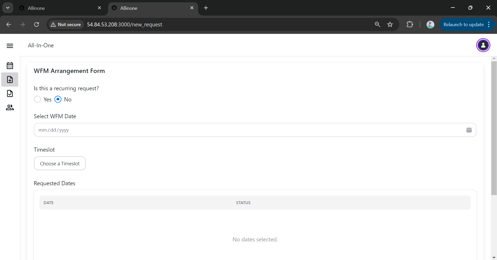
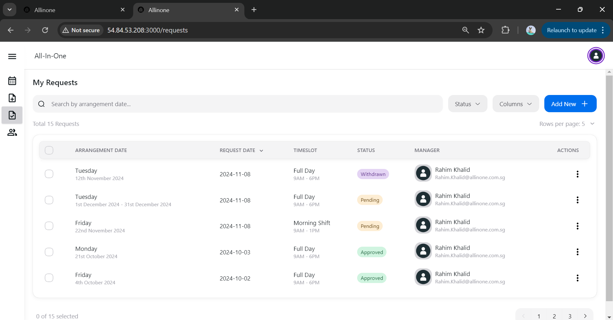
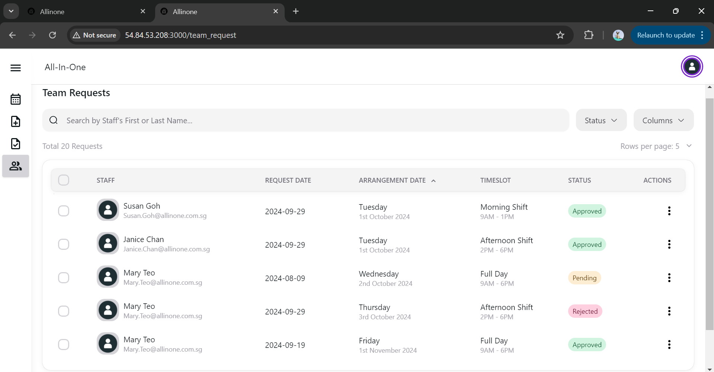
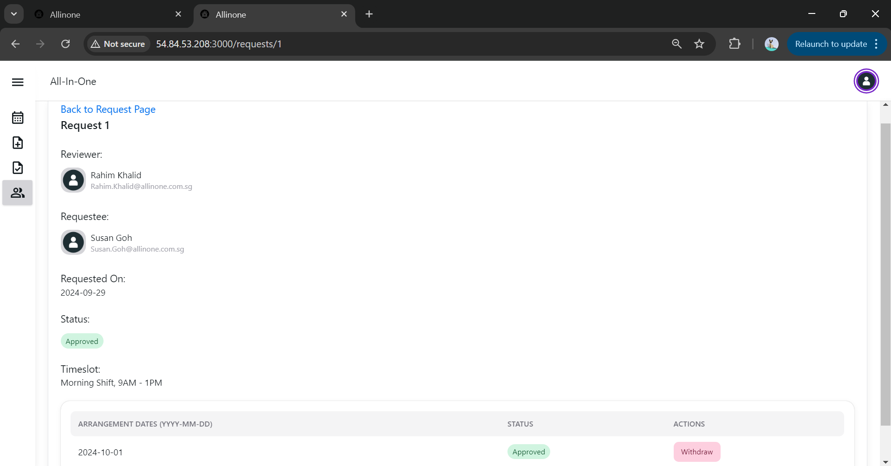

# is212-spm
IS212_G3T5

Done By:

Brannon Cho
Cedric Lim
Chan Wai Wen
Chen Wen Han
Khoo Teck Xuan
Yep Zhi Xuan

# Allinone
Allinone is a scheduler application which will help: 
    1. Staff to view their team's and their personal Work From Home (WFH) arrangements and apply for such arrangements
    2. Managers track team's schedules and approve/reject staff WFH requests
    3. HR to view team and the company's overall schedule     

## Table of Contents
- [Installation](#installation)
- [Project Links](#project-links)
- [Development Setup](#development-setup)
- [Accessing Calendar Views](#accessing-calendar-views)
- [Usage](#usage)
- [License](#license)

## Project Links
Github repo URL: https://github.com/cedriclyh/is212-spm
Website URL: http://54.84.53.208:3000/

### Prerequisites
 - React
 - Flask
 - Docker

## Development Setup
1. Clone the repository:
   ```bash
   git clone https://github.com/cedriclyh/is212-spm.git
   cd is212-spm
   ``` 
2. Run the application
    ```bash
    docker-compose up --build
    ```

After the application has been run, the application should start by itself in development mode.  

### Deployment
The application was deployed as an EC2 instance on AWS and can be accessed through this (http://54.84.53.208:3000/)

## Usage

### Login View (Base View)
This is a placeholder for the actual login page offering authentication. Upon successful login, the user will be brought to the calendar view based on their role. 



### Accessing Calendar Views
To access different calendar views based on roles, you are required to **change the URL path**. 

As user authentication will be subsequently handled by Azure, for the purpose of demonstrating the functinality of each calendar view, the user of each view has been hardcoded into the app.

#### Staff View
Path: /staff
User: 140002

The staff view is the most basic view, allowing users to view their schedule as well as team schedule. There is also a [dashboard](#dashboard) to show the team member count in the office and at home.   



#### Manager View
Path: /manager
User: 140894

The manager view includes the basic view of a staff, as well as a button to [block out dates](#blockout).     


#### HR View
Path: /hr
User: 130002

The HR has the basic view of a staff, as well as all the other departments' schedules.



#### Director View
Path: /director
User: 140001

#### Dashboard
The dashboard shows the number of team members who are in the office and who are on WFH arrangement. The user must select a date from the calendar to be able to see the information on the dashboard. 



### Blockout
Blockouts is located in the [Manager Calendar View](#manager-view) allow 



### New Request
In the New Request page, the staff is able to request for an arrangement. Arrangements can be for the whole day, morning or afternoon. There is also an option to select if the arrangement will be one-time or recurring on a particular day of the week (over a date range).  



### My Requests
My Requests lists all personal requests made by the staff. The staff is able to filter the requests by status and can also add request for a new arrangement. There is an action column that allows users to [view](#view), edit, and cancel their request.



### Team Requests
The Team Requests page shows all team requests and should only accessible by the manager. From here, there is an action column for which the manager can click to (#view), withdraw, approve, and reject requests. 



### View Request
View Request will show the details of the request, including the request number, request date, and reviewer & reviewee. It also lists all the arrangements that are part of the request, and shows the status and any subsequent action that was made.



### Edit Request
Looks the same as the [View Request](#view-request) page. Submitting the form will change the request according to the edits made by the user. 


